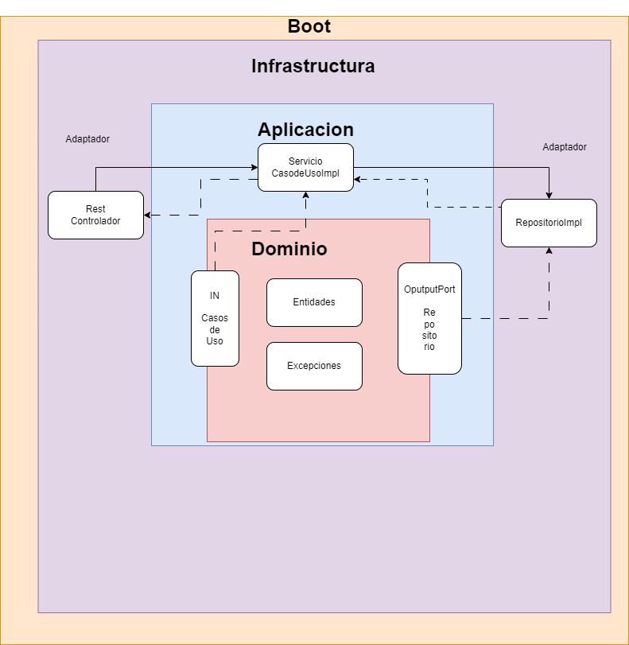

# Proyecto de prueba de Java


## Descripción del Proyecto

Este proyecto es una aplicación de gestión de precios que permite a los usuarios buscar y obtener precios de productos para una marca y fecha específicas.

## Estado del Proyecto

El proyecto está actualmente en desarrollo.

## Características de la Aplicación y Demostración

- Búsqueda de precios por marca, producto y fecha.
- Visualización de precios ordenados por prioridad y precio.

## Acceso al Proyecto

Puedes acceder al proyecto en el siguiente enlace: [Proyecto de Gestión de Precios](link_al_proyecto)

## Tecnologías Utilizadas

- Java
- Spring Boot
- Maven (Gestión de Dependencias y Construcción del Proyecto)
  - Spring Boot Starter Data JPA
  - H2 Database
  - Lombok
  - MapStruct

## Arquitectura

Se ha utilizado la arquitectura hexagonal (también conocida como puertos y adaptadores) para este proyecto, que promueve una separación clara entre la lógica de negocio y la lógica de la interfaz de usuario, lo que facilita la prueba y el mantenimiento del código.

A continuación, se muestra un diagrama de la arquitectura hexagonal del proyecto:

[](img.png)

## Pruebas

Se han realizado pruebas unitarias y de integración para garantizar el correcto funcionamiento del sistema.

### Pruebas Unitarias

 Se han utilizado frameworks como JUnit y Mockito para realizar estas pruebas.

### Método Opcional para Obtener Precios

En la aplicación, se ha implementado un método opcional `getPriceListsByBrandIdAndProductIdAndDate` en el servicio de precios. Este método se utiliza en caso de que la lógica de la base de datos no cumpla con los criterios acordados.

Este método devuelve una lista de precios para una marca, producto y fecha específicos. Si se encuentran varios precios con la misma prioridad, emite un log de advertencia y devuelve los precios ordenados por precio de mayor a menor.

### Ejemplo de Uso en Local

Para utilizar el servicio de precios en local, puedes realizar una llamada HTTP GET a la siguiente URL:

```bash
GET  'http://localhost:8080/prueba/price?brandId=1&productId=35455&date=2020-06-07T00:00:00' 
 
  ```
## Personas Desarrolladoras del Proyecto

- Manuel Comesaña Couto (ccoutomanu@gmail.com)

## Licencia

Este proyecto está bajo la Licencia MIT. Para más detalles, consulta el archivo [LICENSE](LICENSE).

## Conclusion

Este README proporciona una descripción general del proyecto, sus características, estado actual, tecnologías utilizadas y cómo acceder al proyecto. Además, incluye información sobre los contribuyentes y desarrolladores del proyecto, así como la licencia bajo la cual se distribuye el software.

